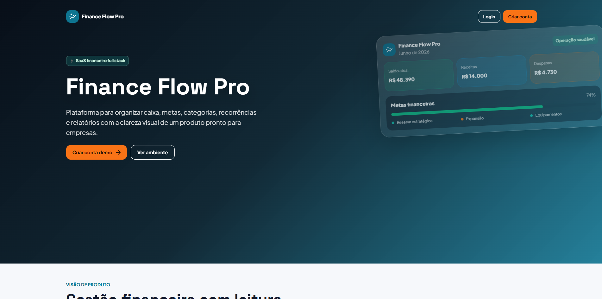
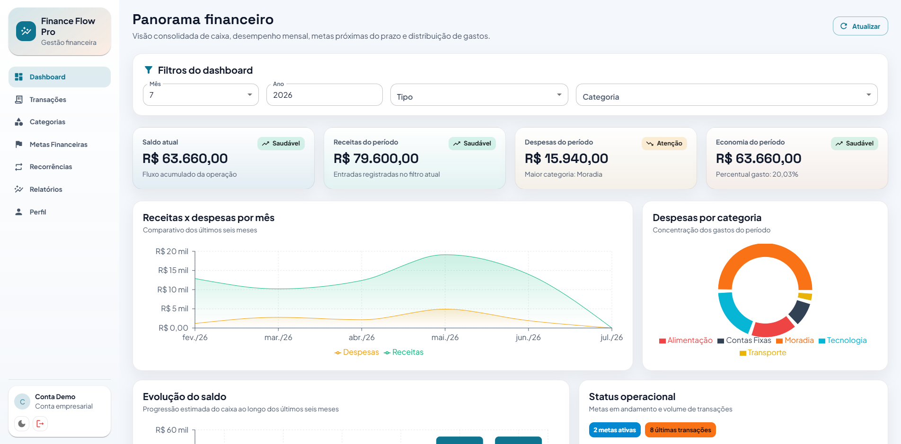
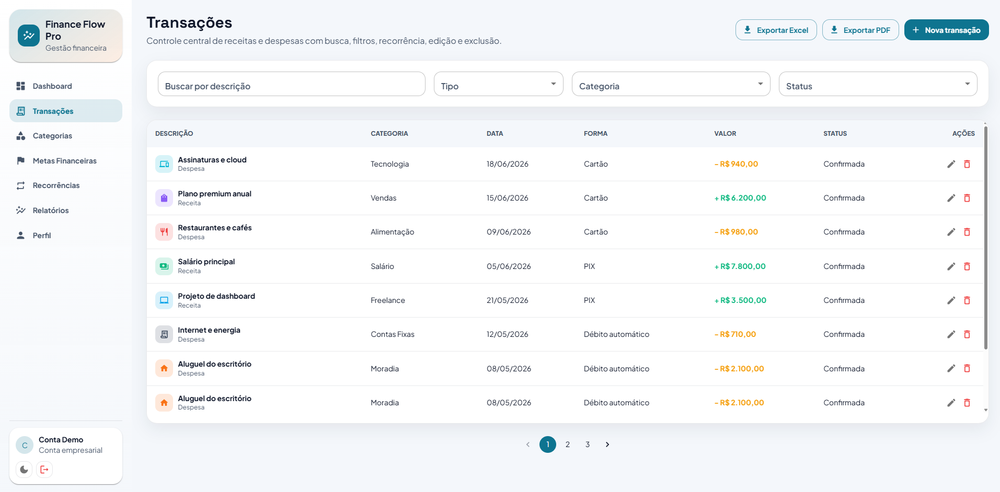
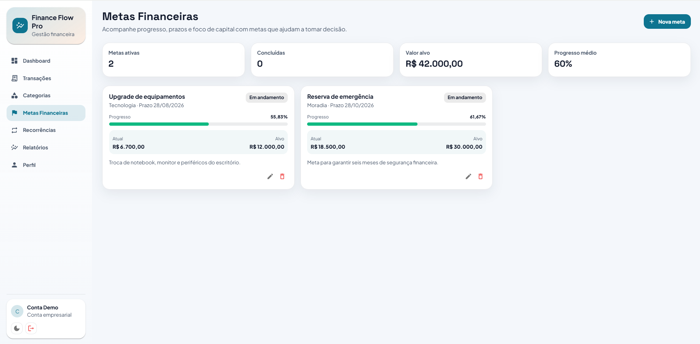

# 💰 Sistema de Gestão Financeira

> Sistema Full Stack de Gestão Financeira desenvolvido com **Java,
> Spring Boot, React, PostgreSQL e Docker**, simulando uma aplicação
> corporativa para controle de receitas, despesas e indicadores
> financeiros.


------------------------------------------------------------------------

## 📚 Sobre

Aplicação Full Stack para gerenciamento financeiro pessoal e
empresarial. O sistema permite controlar receitas, despesas, categorias,
dashboards, relatórios e indicadores, utilizando arquitetura em camadas,
autenticação JWT e interface moderna.

## ✨ Funcionalidades

-   Login e autenticação JWT
-   Dashboard financeiro
-   Controle de receitas
-   Controle de despesas
-   Categorias financeiras
-   Relatórios e gráficos
-   Pesquisa e filtros
-   Exportação de dados
-   Swagger/OpenAPI
-   Docker Compose

## 🏗️ Arquitetura

``` text
React
  │
Axios
  │
Spring Boot
  │
Spring Security + JWT
  │
Services
  │
Repositories (JPA)
  │
PostgreSQL
```

## 🛠️ Tecnologias

### Backend

-   Java 21
-   Spring Boot
-   Spring Security
-   Spring Data JPA
-   Hibernate
-   JWT
-   Flyway
-   Bean Validation
-   Swagger/OpenAPI

### Frontend

-   React
-   Vite
-   Material UI
-   Axios
-   Recharts

### Banco de Dados

-   PostgreSQL

### Infraestrutura

-   Docker
-   Docker Compose
-   Nginx

## 📂 Estrutura

``` text
gestao-financeira/
├── backend/
├── frontend/
├── docker-compose.yml
└── README.md
```

## ▶️ Como executar

``` bash
git clone https://github.com/matheus-samuel-dev/sistema-gestao-financeira.git
cd sistema-gestao-financeira
docker compose up --build
```

Ou execute frontend e backend separadamente.

## 📊 Dashboard

-   Saldo atual
-   Receitas do mês
-   Despesas do mês
-   Evolução do saldo
-   Receitas × Despesas
-   Despesas por categoria
-   Últimas movimentações

## 🔐 Segurança

-   Spring Security
-   JWT
-   Rotas protegidas
-   Validação de dados
-   Tratamento centralizado de exceções

## 📡 Swagger

``` text
http://localhost:8080/swagger-ui.html
```

## 📸 Screenshots

### 🏠 1. Login

Tela inicial da aplicação, com acesso seguro através de autenticação JWT.

<p align="center">
  
</p>

---

### 📊 2. Dashboard

Visão geral das finanças com indicadores, gráficos, fluxo de caixa e resumo das principais métricas.

<p align="center">
  
</p>

---

### 💸 3. Transações

Gerenciamento completo de receitas e despesas, com filtros, paginação, exportação para PDF/Excel e operações de edição e exclusão.

<p align="center">
  
</p>

---

### 🎯 4. Metas

Acompanhamento de metas financeiras, progresso, valores acumulados e objetivos planejados.

<p align="center">
  
</p>

## 🚀 Roadmap

-   [x] Dashboard
-   [x] CRUD de Receitas
-   [x] CRUD de Despesas
-   [x] Categorias
-   [x] Docker
-   [x] Swagger
-   [ ] Metas Financeiras
-   [ ] Notificações
-   [ ] Aplicativo Mobile

## 👨‍💻 Autor

**Matheus Samuel**

-   GitHub: https://github.com/matheus-samuel-dev
-   LinkedIn: https://linkedin.com/in/matheus-samuel-dev
-   Portfólio: https://matheus-samuel-dev.github.io/Portfolio/

## 📄 Licença

Projeto desenvolvido para fins de estudo, demonstração técnica e
portfólio.
